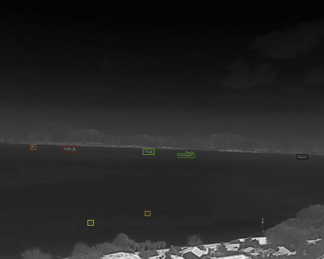
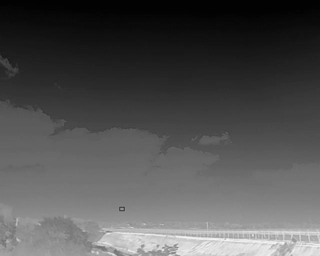
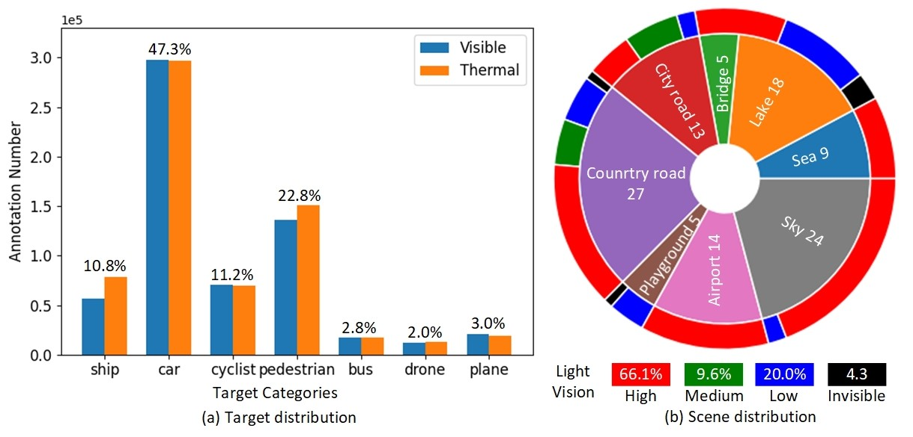
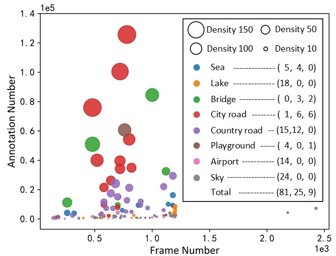
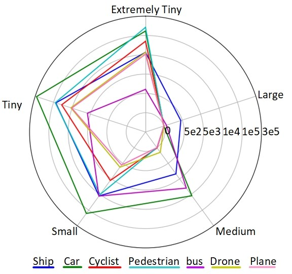
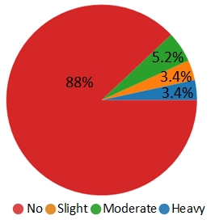

# *
RGBT-Tiny: A Large-Scale Benchmark for Visible-Thermal Tiny Object Detection
*

***RGBT-Tiny is a large-scale visible-thermal benchmark which consists of 115 high-quality paired image sequence, 93K frames and 1.2M manual annotations,and covers abundant targets and diverse senarios. Details of this dataset can be found in our paper. Over 81\% of targets are smaller than 16x16, and we provide paired bounding box annotations with tracking id to offer an extremely challenging benchmark with wide-range applications, such as RGBT fusion, detection and tracking.***  

## Sample Videos

     &nbsp&nbsp&nbsp
 

 

     &nbsp&nbsp&nbsp
 

 

     &nbsp&nbsp&nbsp
 

 

     &nbsp&nbsp&nbsp
 

 

     &nbsp&nbsp&nbsp
 
  

## Benchmark Properties

### Rich Diversity

  
Fig. 1 (a) Target distribution in visible and thermal modalities. (b) Scene distribution (inner circle) across different light visions (outer circle). 

### Large Density Variation

  

Fig. 2 Density of each sequence. ($x$,$y$,$z$) are the numbers of sequences w.r.t. density levels (i.e., sparse, medium, dense).  

### Small-Scale Targets

 

Fig. 3 Size distribution of each target category.  

### Temporal Occlusion

 

Fig. 4 Temporal occlusion (i.e., no occlusion, slight occlusion, moderate occlusion, heavy occlusion).    

## Downloads
Downloads will be released upon acceptance.